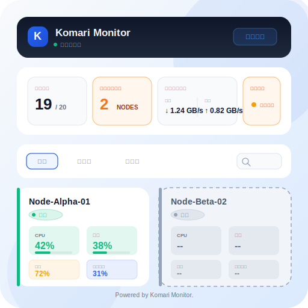
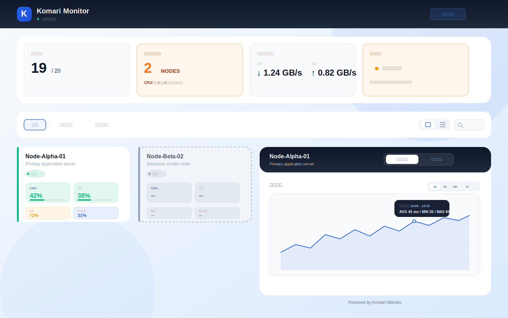

# Komari Minimal Theme

为 [Komari Monitor](https://github.com/komari-monitor/komari) 设计的简约风格主题，基于 React、TypeScript 和 Vite 构建。

## 安装

1. 打开本仓库的 `Releases` 页面。
2. 下载最新的主题安装包 `komari-theme-*.zip`。
3. 进入 Komari 的主题设置页面。
4. 上传刚刚下载的 zip 安装包并应用主题。

## 预览

## 主题特点

- 简约清晰的监控面板布局
- 响应式页面，适配桌面与移动端
- 内置主题配置项，可在 Komari 中直接调整标题、强调色、默认视图等
- 发布产物为可直接安装的主题 zip 包

## 可配置项

主题通过 `komari-theme.json` 提供可视化配置，主要包括：

- 标题与副标题
- 强调色
- 默认分组
- 默认视图模式
- 是否显示离线节点
- 负载与 Ping 历史窗口
- 自动刷新间隔
- 页脚文案

## 开发

如果你想本地调试、构建或重新打包这个主题，可以查看以下文档：

- [开发说明](docs/development.md)
- [发布说明](docs/publishing.md)
